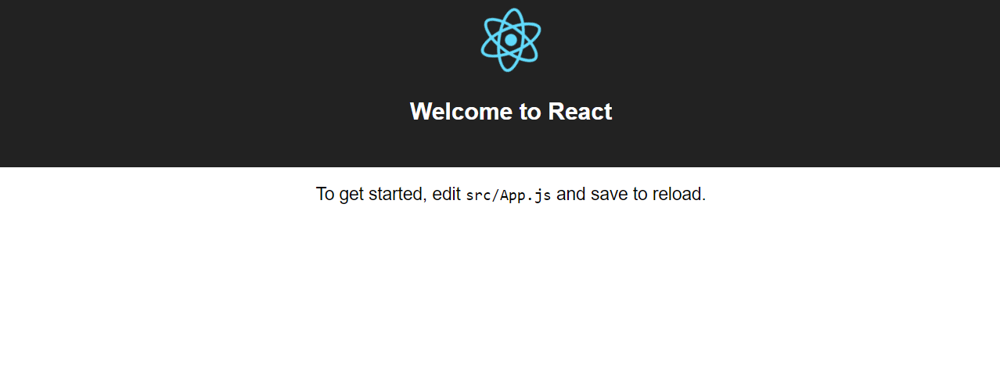
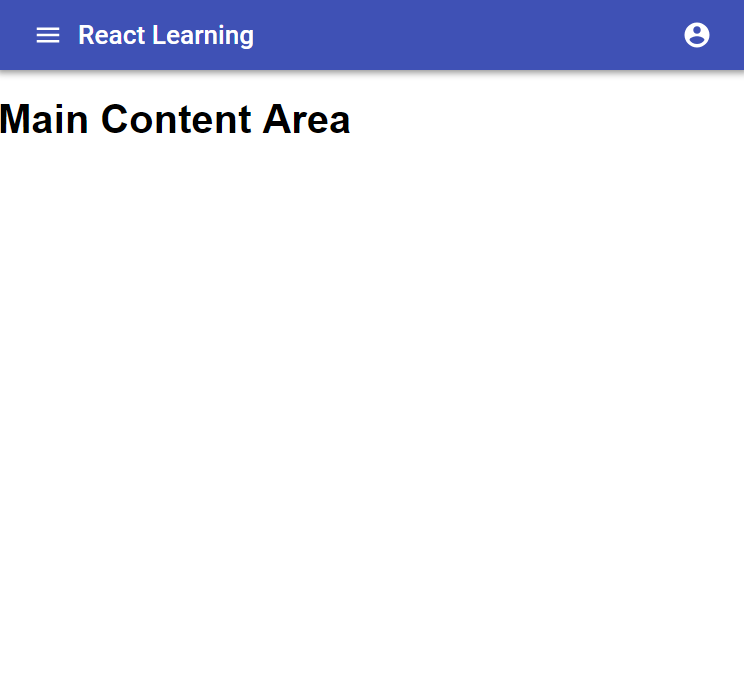
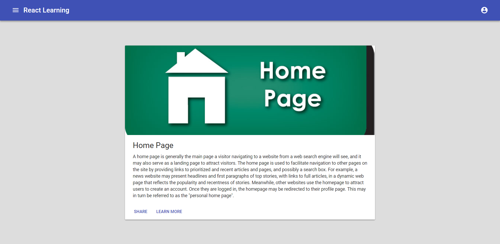

# Learning and Setting up React

Create React apps with no build configuration
Make sure Nodejs with version greater than 6 is installed.

## Quick Overview

```sh
npx create-react-app my-app
```
This  creates a folder my-app inside current folder and sets up the inital project structure 

```
my-app
├── README.md
├── node_modules
├── package.json
├── .gitignore
├── public
│   ├── favicon.ico
│   ├── index.html
│   └── manifest.json
└── src
    ├── App.css
    ├── App.js
    ├── App.test.js
    ├── index.css
    ├── index.js
    ├── logo.svg
    └── registerServiceWorker.js
```

```sh
cd my-app
npm start
```

This starts up the app and can be viewed on http://localhost:3000/ 

Initial Screen:

<p align='center'>

</p>


## Setting up Material UI

Material UI is one of the most popular open source framework for developing responsive, mobile-first websites. You don’t have to use Material UI together with React but it is a popular library with inbuilt components for integrating with React apps. 

```sh
npm install --save @material-ui/icons @material-ui/core typeface-roboto
```

Import Roboto Font in the beginning of your src/index.js file:

```sh
import 'typeface-roboto';
// Put any other imports below so that CSS from your
// components takes precedence over default styles.
```

Import required React Material components within src/App.js file or your custom component files:

```sh
import AppBar from '@material-ui/core/AppBar';
```

Now you are ready to use the imported React Material components within your component hierarchy defined in the render method. Here is the <a href="https://material-ui.com/getting-started/installation/">link</a> to read more on the react material components.

Let us build a simple Header component with react material components and render it.

* Add components folder inside src and create a new file Header.js

```sh
// src/components/Header.js

import React, { Component } from 'react';
import AppBar from '@material-ui/core/AppBar';
import Toolbar from '@material-ui/core/Toolbar';
import IconButton from '@material-ui/core/IconButton';
import Typography from '@material-ui/core/Typography';
import MenuIcon from '@material-ui/icons/Menu';
import AccountCircle from '@material-ui/icons/AccountCircle';
import MenuItem from '@material-ui/core/MenuItem';
import Menu from '@material-ui/core/Menu';
import { withStyles } from '@material-ui/core/styles';
const styles = {
  root: {
    flexGrow: 1,
  },
  flex: {
    flex: 1,
  },
  menuButton: {
    marginLeft: -12,
    marginRight: 20,
  },
};

export default withStyles(styles)( class Header extends Component {
  state = {
    auth: true,
    anchorEl: null,
  };


  handleMenu = event => {
    //Open Left
    this.setState({ anchorEl: event.currentTarget });
  };

  handleClose = () => {
    this.setState({ anchorEl: null });
  };
  render(){
    const { classes } = this.props;
    const { anchorEl } = this.state;
    const open = Boolean(anchorEl);

        return (
          <AppBar position="static">
          <Toolbar>
            <IconButton color="inherit" aria-label="Menu">
              <MenuIcon />
            </IconButton>
            <Typography variant="title" color="inherit" className={classes.flex}>
              React Learning
            </Typography>
           
              <div>
                <IconButton
                  aria-owns={open ? 'menu-appbar' : null}
                  aria-haspopup="true"
                  onClick={this.handleMenu}
                  color="inherit">
                  <AccountCircle />
                </IconButton>
                <Menu
                  id="menu-appbar"
                  anchorEl={anchorEl}
                  anchorOrigin={{
                    vertical: 'top',
                    horizontal: 'right',
                  }}
                  transformOrigin={{
                    vertical: 'top',
                    horizontal: 'right',
                  }}
                  open={open}
                  onClose={this.handleClose}
                >
                  <MenuItem onClick={this.handleClose}>Profile</MenuItem>
                  <MenuItem onClick={this.handleClose}>My account</MenuItem>
                </Menu>
              </div>
          </Toolbar>
        </AppBar>
          );
    }

})

}
```

* Update App.js to refer to Header component we just built

```sh
// src/App.js 

import React, { Component } from 'react';
import './App.css';
import Header from './components/Header.js'
export default class App extends Component {
  render() {
    return (
    <div>
      <Header/>
      <h1>Main Content Area</h1>
    </div>);

  }

}
```

* Run the app with 
```sh 
npm start 
```
The app should start and the page should now look like this:

<p align='center'>

</p>

## Setting up routes
 
 Let us create a main component where we will define different routes to different pages.

 * First update App.js to render newly created Main Component in src/components
```sh
// src/App.js 

import React, { Component } from 'react';
import './App.css';
import Header from './components/Header.js';
import Main from './components/Main.js'
export default class App extends Component {
  render() {
    return (
    <div>
      <Header/>
      <Main/>
    </div>);

  }

}
```

* Let us install react-router-dom package. This will be used to define different routes.
```sh
npm install react-router-dom --save
```
You can read more about react router <a href="https://reacttraining.com/react-router/web/example/basic">here</a>

* Let us define Main.js with different routes
```sh
//src/compoennts/Main.js
import React, { Component } from 'react';
import { BrowserRouter as Router, Route } from "react-router-dom";
import Home from './Home.js';
export default class Main extends Component{
    render(){
        return(
            <Router>
            <div>
              <Route exact path="/" component={Home} />
              <Route path="/about" component={About} />
            </div>
          </Router>
        );
    }
}
const About = () => (
    <div>
      <h2>About</h2>
    </div>
  );
```
Let us also define Home component

```sh
//src/components/Home.js
import React, { Component } from 'react';
import { withStyles } from '@material-ui/core/styles';
import Card from '@material-ui/core/Card';
import CardActions from '@material-ui/core/CardActions';
import CardContent from '@material-ui/core/CardContent';
import CardMedia from '@material-ui/core/CardMedia';
import Button from '@material-ui/core/Button';
import Typography from '@material-ui/core/Typography';
import HomeLogo from '../home-page.jpg';
const styles = {
    card: {
        width: '50%',
        marginLeft:'25%',
        marginTop:'5%'
    },
    media: {
      height: '275px'
    }
  };

export default withStyles(styles) (class Home extends Component{
    render(){
        const classes = this.props.classes;
        return(
            <div>
            <Card className={classes.card}>
              <CardMedia
                className={classes.media}
                image={HomeLogo}
                title="Home"
              />
              <CardContent>
                <Typography gutterBottom variant="headline" component="h2">
                  Home Page
                </Typography>
                <Typography component="p">
                A home page is generally the main page a visitor navigating to a website from a web search engine will see, and it may also serve as a landing page to attract visitors.
                The home page is used to facilitate navigation to other pages on the site by providing links to prioritized and recent articles and pages, and possibly a search box.
                For example, a news website may present headlines and first paragraphs of top stories, with links to full articles, in a dynamic web page that reflects the popularity and recentness of stories. Meanwhile, other websites use the homepage to attract users to create an account. Once they are logged in, the homepage may be redirected to their profile page. 
                This may in turn be referred to as the "personal home page".   </Typography>
              </CardContent>
              <CardActions>
                <Button size="small" color="primary">
                  Share
                </Button>
                <Button size="small" color="primary">
                  Learn More
                </Button>
              </CardActions>
            </Card>
          </div>
        );
    }
})
```
Make sure to add home-page.jpg image in src folder and also update Index.cs
```sh
body {
  margin: 0;
  padding: 0;
  font-family: "Roboto", "Helvetica", "Arial", sans-serif;
  background-color: #dddddd;
}
```
* The page will load home page card at http://localhost:3000/ and just about message when routing to http://localhost:3000/about

<p align='center'>

</p>

## Inter Components Data Flow